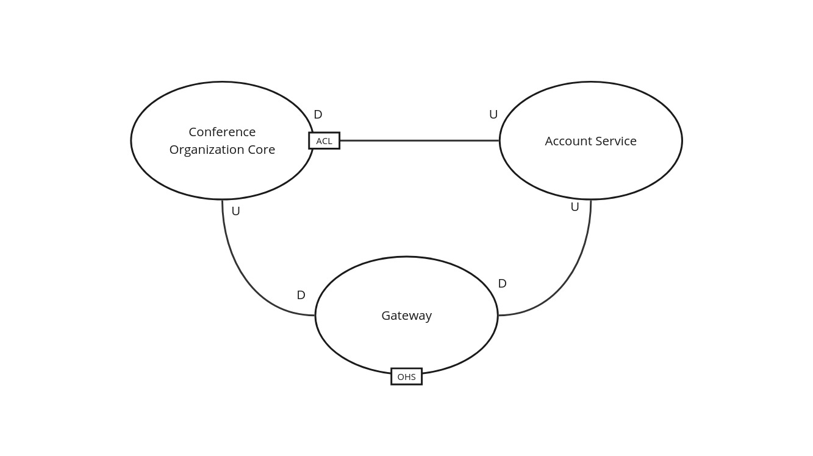

# Solution space

## Bounded context

- **Conference Organization Core**: covers conference, talk registration and listener's registration for a talk.
- **Account Service**: covers organizer, speaker and listener registration.
- **Gateway**: API Gateway to provide restful API to the users to interact with the system.

## Context map

> miro board link: https://shorturl.at/CjLzw.